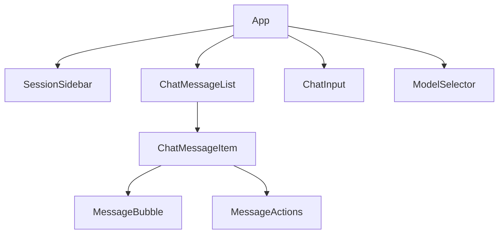

# 应用架构

## 设计原则

本应用未使用第三方的状态管理库，只使用 React 自带的状态管理功能。通过 Context 定义全局状态，通过自定义 Hook 实现业务逻辑复用。

本应用大致遵循了 React 应用的最佳实践，采用组件化设计模式构建界面，并进行了渲染和业务逻辑的分离。

## 项目结构

```txt
.
├── src/
│   ├── assets/               # 素材
│   ├── mocks/                # 模拟响应
│   ├── components/           # 组件
│   ├── contexts/             # 上下文
│   ├── hooks/                # 自定义钩子
│   ├── services/             # 服务
│   ├── types/                # 类型定义
│   ├── utils/                # 工具函数
│   ├── App.tsx               # 应用根组件
│   └── main.tsx              # 入口文件
├── public/                   # 静态资源
├── requests/                 # 接口测试
└── docs/                     # 文档
```

## 组件树



- **App**: 应用根组件，组织所有子组件并提供核心功能
- **SessionSidebar**: 会话侧边栏，管理多会话切换、创建和删除
- **ChatMessageList**: 消息列表，展示对话历史
- **ChatMessageItem**: 单个消息项，包含头像、内容和操作按钮
- **MessageBubble**: 消息内容展示组件
- **MessageActions**: 消息操作组件，提供复制、重新生成等功能
- **ChatInput**: 聊天输入框，处理用户输入和发送
- **ModelSelector**: 模型选择器，切换不同的 AI 模型
