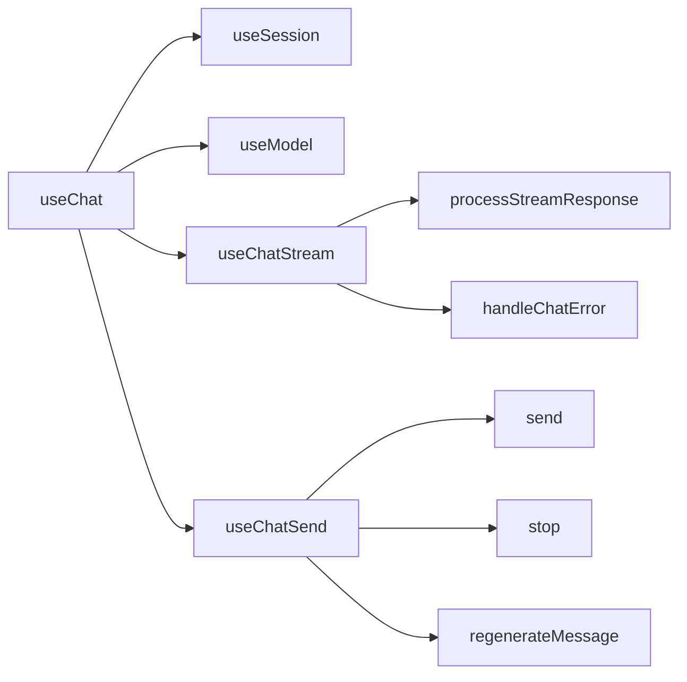
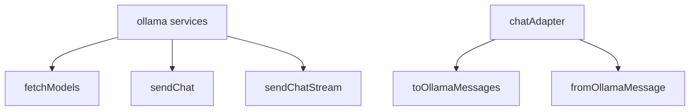
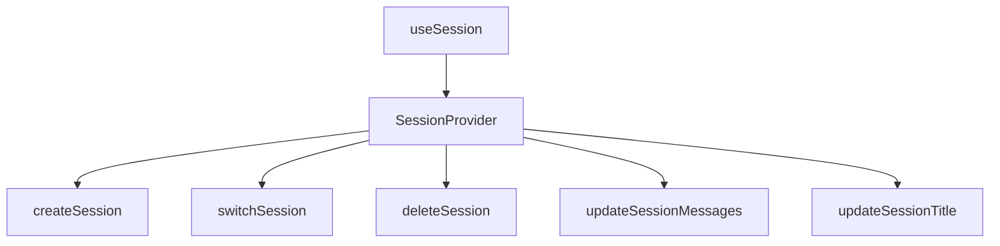

# 实现细节

> [!Note] 以实际代码为准
>
> 由于文档可能无法得到及时维护，如有出入，一切请以实际代码为准。
>
> 这一部分会从源代码中摘出部分作为示例。为了突出逻辑，代码示例中可能会擦除类型，并重新处理缩进

## 核心数据结构

参阅 `src/types` 目录里的文件 [chat.ts](../src/types/chat.ts)

```ts
export type ChatRole = 'user' | 'assistant'

export interface ChatMessage {
  id: string // 唯一标识
  role: ChatRole // 角色
  content: string // 消息内容
  timestamp: number // 时间戳
  isFinished?: boolean // 回复是否完成
  isError?: boolean // 回复是否出错
}

export interface ChatSession {
  id: string // 唯一标识
  title: string // 标题
  createdAt: number // 创建时间
  updatedAt: number // 更新时间
  messages: ChatMessage[] // 消息列表
}
```

## 核心功能

项目结构、组件树的介绍放在了[应用架构](ARCH.md)文档里。

以下是几个核心模块的详细实现思路和技术方案，其余拓展功能的实现放到了[后面的部分](#拓展功能)

### 聊天模块

聊天模块是应用的核心，由多个专用 Hooks 组成，实现消息发送、接收、流式展示等功能。采用了组合式 Hook 设计模式，将不同职责分离到独立的 Hook 中，提高代码可维护性。



#### 核心处理流程

1. **消息发送流程**：
   - 用户在 ChatInput 组件中输入消息并点击发送
   - `useChatSend.send()` 方法被调用
   - 生成用户消息和 AI 占位消息，更新到会话中
   - 构建 Ollama API 请求 payload
   - 使用 AbortController 创建可中断的请求
   - 调用 `useChatStream.processStreamResponse()` 处理流式响应

2. **流式响应处理**：
   - `processStreamResponse` 使用异步生成器逐块接收 AI 回复
   - 每接收一块数据就更新一次 AI 消息内容，实现打字机效果
   - 响应完成后，标记 AI 消息为已完成状态
   - 错误处理通过 `handleChatError` 统一管理，设置错误状态并显示提示信息

3. **消息重生成机制**：
   - 支持重新生成 AI 回复，保留上下文历史
   - 自动替换上一条 AI 消息，无需重复用户输入

```ts
// src/hooks/useChat.ts
export function useChat() {
  // 组合多个专用钩子
  const { currentMessages: messages, updateSessionMessages } = useSession()
  const { models, model, setModel } = useModel()
  const { processStreamResponse, handleChatError } = useChatStream({
    updateSessionMessages,
  })
  const [loading, setLoading] = useState(false)
  const { input, setInput, send, stop, regenerateMessage } = useChatSend({
    updateSessionMessages,
    model,
    messages,
    loading,
    setLoading,
    processStreamResponse,
    handleChatError,
  })

  return { /* 导出所有必要的状态和方法 */ }
}
```

### 服务通信模块

服务通信模块负责与 Ollama API 进行交互，采用了适配器模式实现消息格式转换，提高系统可扩展性，使其易于支持其他 API 格式。



#### 关键技术实现

1. **流式响应处理**：
   - 使用 `fetch API` 的 `ReadableStream` 和 `AsyncGenerator` 实现流式数据处理
   - 采用增量解码和行分割解析 JSON，确保实时响应
   - 支持通过 `AbortSignal` 中断正在进行的请求

2. **适配器模式**：
   - 通过 `chatAdapter.ts` 实现本地聊天消息和 Ollama API 消息格式的双向转换
   - 这种设计使得未来切换底层 AI 服务变得简单，只需实现新的适配器即可

3. **错误处理**：
   - 统一的错误处理机制，包括连接检查、响应状态验证
   - 提供友好的错误提示给用户

```ts
// src/services/ollama.ts
export async function* sendChatStream(
  payload: OllamaRequest,
  signal?: AbortSignal,
): AsyncGenerator<string, void, void> {
  const res = await fetch(`${BASE_URL}/api/chat`, {
    method: 'POST',
    headers: { 'Content-Type': 'application/json' },
    body: JSON.stringify({ ...payload, stream: true }),
    signal,
  })

  if (!res.ok || !res.body) throw new Error('Stream response error')
  
  // 流式处理实现
  const reader = res.body.getReader()
  const decoder = new TextDecoder('utf-8')
  let buffer = ''
  
  while (true) {
    const { value, done } = await reader.read()
    if (done) break
    
    // 增量解析和处理
    buffer += decoder.decode(value, { stream: true })
    // 按行分割处理 JSON
    let idx
    while ((idx = buffer.indexOf('\n')) >= 0) {
      const line = buffer.slice(0, idx).trim()
      buffer = buffer.slice(idx + 1)
      if (!line) continue
      try {
        const obj = JSON.parse(line)
        if (obj.message && obj.message.content) {
          yield obj.message.content
        }
      } catch (e) {
        console.log(e)
      }
    }
  }
}
```

### 会话管理模块

会话管理模块负责处理多会话的创建、切换、删除和消息更新，采用 Context API 实现全局状态管理，并通过 localStorage 实现会话数据的持久化存储。



#### 核心设计特点

1. **状态管理**：
   - 使用 React Context API 实现全局会话状态管理
   - 通过自定义 Hook `useSession` 提供简洁的访问接口
   - 确保在组件树中的任何位置都能访问和修改会话数据

2. **持久化存储**：
   - 利用自定义 Hook `useLocalStorage` 将会话数据自动同步到浏览器的 localStorage
   - 活动会话 ID 单独存储，确保页面刷新后能恢复到之前的会话
   - 应用启动时自动从 localStorage 加载会话数据

3. **会话生命周期管理**：
   - 自动初始化：无会话时自动创建默认会话
   - 会话切换：支持在多个会话间无缝切换
   - 会话删除：智能处理删除当前活动会话的情况，避免界面空白
   - 自动命名：基于第一条用户消息自动生成会话标题

4. **性能优化**：
   - 使用 `useCallback` 优化函数引用，避免不必要的重渲染
   - 采用延迟创建机制 `setTimeout` 避免级联渲染问题
   - 提供函数式更新接口，便于状态计算和合并

```tsx
// src/contexts/SessionProvider.tsx
export const SessionProvider: React.FC<{ children: ReactNode }> = ({ children }) => {
  // 从 localStorage 加载会话列表
  const [sessions, setSessions] = useLocalStorage<ChatSession[]>('chat_sessions', [])
  const [activeSessionId, setActiveSessionId] = useState<string>(() => {
    // 尝试恢复之前的活动会话
    const savedId = localStorage.getItem('active_session_id')
    if (savedId && sessions.some((session) => session.id === savedId)) {
      return savedId
    }
    return sessions.length > 0 ? sessions[0].id : ''
  })

  // 更新会话消息
  const updateSessionMessages = useCallback((
    messagesOrUpdater: ChatMessage[] | ((prevMessages: ChatMessage[]) => ChatMessage[])
  ) => {
    if (!activeSessionId) return

    setSessions((prev) => prev.map((session) => {
      if (session.id === activeSessionId) {
        // 支持直接更新或函数式更新
        const messages = typeof messagesOrUpdater === 'function' 
          ? messagesOrUpdater(session.messages)
          : messagesOrUpdater

        // 自动根据首条消息更新会话标题
        let updatedTitle = session.title
        if (session.title === '新对话' && messages.length >= 1) {
          const firstUserMsg = messages.find((msg) => msg.role === 'user')
          if (firstUserMsg) {
            updatedTitle = firstUserMsg.content.slice(0, 30) + 
              (firstUserMsg.content.length > 30 ? '...' : '')
          }
        }

        return {
          ...session,
          messages,
          updatedAt: Date.now(),
          title: updatedTitle,
        }
      }
      return session
    }))
  }, [activeSessionId, setSessions])

  // 提供给组件树的上下文值
  const contextValue: SessionContextType = {
    sessions,
    activeSessionId,
    activeSession,
    currentMessages,
    createSession,
    switchSession,
    deleteSession,
    updateSessionMessages,
    updateSessionTitle,
  }

  return (
    <SessionContext.Provider value={contextValue}>
      {children}
    </SessionContext.Provider>
  )
}
```

## 拓展功能

### Markdown 渲染

使用了第三方库 [react-markdown](https://www.npmjs.com/package/react-markdown) 来渲染 Markdown 文本

主要代码在 [MessageBubble.tsx](../src/components/ChatMessageItem/MessageBubble.tsx) 文件中

```jsx
import Markdown from 'react-markdown'

const MessageBubble = ({ message }) => {
  if (message.role === 'assistant') {
    return (
      <div className="markdown-body">
        <Markdown components={{ code: CodeBlock }}>{message.content}</Markdown>
      </div>
    )
  }
  return <pre>{message.content}</pre>
}
```

#### 代码高亮

使用了第三方库 [react-syntax-highlighter](https://www.npmjs.com/package/react-syntax-highlighter) 来进行代码的语法高亮

主要代码也在 [MessageBubble.tsx](../src/components/ChatMessageItem/MessageBubble.tsx) 文件中

不过此处遇到了一些奇怪的问题。尽管我几乎和[官方文档](https://www.npmjs.com/package/react-syntax-highlighter#prism)的做法完全一样，但还是遇到了类型问题的警告。因此这里出现了本项目的第一个 `// @ts-expect-error`，希望这也是最后一个 `:(`

```jsx
import { Prism as SyntaxHighlighter } from 'react-syntax-highlighter'
import { prism } from 'react-syntax-highlighter/dist/esm/styles/prism'

const CodeBlock = memo(
  ({ children, className, ...rest }) => {
    // ...
    if (lang) {
      return (
        <div className="codeblock-wrapper">
          <div className="codeblock-header">
            <span className="codeblock-lang">{lang}</span>
            <button
              className="codeblock-copy-btn"
              onClick={handleCopy}
              title="复制代码"
              type="button"
            >
              {copied ? '已复制' : '复制'}
            </button>
          </div>
          <SyntaxHighlighter
            language={lang}
            PreTag="div"
            // @ts-expect-error
            style={prism}
            {...rest}
          >
            {codeString}
          </SyntaxHighlighter>
        </div>
      )
    }
    return (
      <code className={className} {...rest}>
        {codeString}
      </code>
    )
  },
)
```

#### 一键复制

[MessageBubble.tsx](../src/components/ChatMessageItem/MessageBubble.tsx) 和 [MessageActions.tsx](../src/components/ChatMessageItem/MessageActions.tsx) 中都用到了复制功能，实现方法是一样的。

通过自定义 [useCopy](../src/hooks/useCopy.ts) 钩子减少代码重复。该钩子导出一个变量和一个回调函数

- `copied` 表示是否被复制
- `handleCopy` 处理实际的复制逻辑

```js
export const useCopy = (content) => {
  const [copied, setCopied] = useState(false)

  const handleCopy = useCallback(() => {
    navigator.clipboard.writeText(content)
    setCopied(true)
    setTimeout(() => setCopied(false), 1200)
  }, [content])

  return { copied, handleCopy }
}
```

### Mock 模拟响应

使用了第三方库 [msw](https://www.npmjs.com/package/msw) 来拦截请求模拟数据

主要代码在 `src/mocks` 文件夹里

#### 配置

由于我希望在浏览器环境里集成 *mock* 功能，因此参照[官方文档](https://mswjs.io/docs/integrations/browser)完成了相关配置

##### [生成脚本](https://mswjs.io/docs/integrations/browser#generating-the-worker-script)

```sh
npx msw init public/ --save
```

##### [配置](https://mswjs.io/docs/integrations/browser#setup)

```js
// src/mocks/browser.ts
import { setupWorker } from 'msw/browser'
import { handlers } from './handlers'

export const worker = setupWorker(...handlers)
```

##### [启用条件](https://mswjs.io/docs/integrations/browser#conditionally-enable-mocking)

```js
// src/main.jsx
async function enableMocking() {
  if (import.meta.env.DEV) {
    const { worker } = await import('./mocks/browser')
    return worker.start()
  }
}

enableMocking().then(() => {
  createRoot(document.getElementById('root')!).render(
  // ...
  )
})
```

#### 处理请求

总共要处理两个请求，实现代码在 [handlers.ts](../src/mocks/handlers.ts) 文件中

##### 模型获取

请求

```http
GET /api/tags HTTP/1.1
Host: localhost:11434
```

响应体

```json
{"models":[{"name":"Markdown 渲染测试"},{"name":"代码块测试"},{"name":"长文本测试"},{"name":"自定义测试"}]}
```

模拟实现

```js
http.get('http://localhost:11434/api/tags', () => {
  return HttpResponse.json({ models })
}),
```

##### 流式回复

请求

```http
POST /api/chat HTTP/1.1
Host: localhost:11434
Content-Type: application/json

{
  "model": "自定义测试",
  "messages": [
    {
      "role": "user",
      "content": "你好"
    }
  ],
  "stream": true
}
```

响应体

```json
{"model":"自定义测试","message":{"role":"assistant","content":"这是自定义"},"done":false}
{"model":"自定义测试","message":{"role":"assistant","content":"测试，只会"},"done":false}
{"model":"自定义测试","message":{"role":"assistant","content":"简单地重复"},"done":false}
{"model":"自定义测试","message":{"role":"assistant","content":"你的输入\n"},"done":false}
{"model":"自定义测试","message":{"role":"assistant","content":"\n你好"},"done":true}
```

模拟实现

```js
http.post<never, OllamaRequest>(
  'http://localhost:11434/api/chat',
  async ({ request }) => {
    const { messages, model } = await request.json()
    const userMsg = messages[messages.length - 1]?.content || ''
    let reply = ''
    switch (model) {
      case 'Markdown 渲染测试':
        {
          const file = files.find((f) => f.filename === 'Markdown.md')
          reply = file ? file.content : '未找到 Markdown 渲染测试文件'
        }
        break
      // 其余内置模拟数据
      default:
        break
    }
    // 模拟流式响应
    const chunks = reply.match(/[\s\S]{1,5}/g) || []
    const delay = 50

    const stream = new ReadableStream({
      async start(controller) {
        for (let i = 0; i < chunks.length; i++) {
          // 模拟延迟
          await new Promise((resolve) => setTimeout(resolve, delay))
          const chunk = chunks[i]
          controller.enqueue(
            new TextEncoder().encode(
              JSON.stringify({
                model,
                message: {
                  role: 'assistant',
                  content: chunk,
                },
                done: i === chunks.length - 1,
              }) + '\n',
            ),
          )
        }
        controller.close()
      },
    })

    return new HttpResponse(stream, {
      headers: {
        'Content-Type': 'application/x-ndjson',
      },
    })
  },
),
```

#### 加载模拟数据

参阅 [loader.ts](../src/mocks/loader.ts) 文件

```js
async function loader() {
  const markdownFiles = import.meta.glob('./data/*.md', {
    query: '?raw',
    import: 'default',
  })
  const entries = Object.entries(markdownFiles)
  const files = await Promise.all(
    entries.map(async ([path, resolver]) => {
      const content = (await resolver()) as string
      const filename = path.split('/').pop() || ''
      return { filename, content }
    }),
  )
  return files
}
export default loader
```

### 流式打字机

#### 流式接口的响应

我先使用了 Ollama 的流式接口，测试文件在 [ollama.rest](../requests/ollama.rest) 中。后来使用 *Mock* 模拟数据时自己实现了一个流式接口，代码在 [handlers.ts](../src/mocks/handlers.ts) 文件中。具体可参考前面[流式回复](#流式回复)的部分

#### 对响应的处理

主要代码在 [useChatStream.ts](../src/hooks/useChatStream.ts) 中

```js
// useChatStream.ts
const processStreamResponse = useCallback(
  async (payload, signal, aiMsgId) => {
    let current = ''
    for await (const chunk of sendChatStream(payload, signal)) {
      current += chunk
      updateSessionMessages((prevMessages) =>
        updateAIMsg(prevMessages, aiMsgId, current),
      )
    }
    // 回复结束，标记 isFinished
    updateSessionMessages((prevMessages) =>
      updateAIMsg(prevMessages, aiMsgId, current, true),
    )
  },
  [updateSessionMessages],
)
```

### 提示信息

#### 加载

主要代码在 [chatMessage.ts](../src/utils/chatMessage.ts) 和 [useChatSend.ts](../src/hooks/useChatSend.ts) 中

```js
// chatMessage.ts
export function insertAIMsg(ctx, aiMsgId) {
  return [
    ...ctx,
    {
      id: aiMsgId,
      role: 'assistant',
      content: 'AI 正在思考...',
      timestamp: Date.now(),
    },
  ]
}

// useChatSend.ts
const prepareChatMessages = useCallback(
  (isRegenerate, customContext, text) => {
    const aiMsgId = genId()

    if (isRegenerate && customContext) {
      updateSessionMessages(insertAIMsg(customContext, aiMsgId))
    } else if (text) {
      const userMsg = {
        id: genId(),
        role: 'user',
        content: text,
        timestamp: Date.now(),
      }
      updateSessionMessages((prevMessages) =>
        insertUserAndAIMsg(prevMessages, userMsg, aiMsgId),
      )
      setInput('')
    }

    return aiMsgId
  },
  [updateSessionMessages, setInput],
)
```

#### 错误

代码主要在 [useChatStream.ts](../src/hooks/useChatStream.ts) 中

```js
// 处理错误
const handleChatError = useCallback(
  (error, signal, aiMsgId) => {
    if (signal.aborted) {
      console.log('生成已停止')
    } else {
      // 回复失败，标记 isError
      console.log(error)
      updateSessionMessages((prevMessages) =>
        updateAIMsg(
          prevMessages,
          aiMsgId,
          'AI 回复失败，请稍后重试',
          undefined,
          true,
        ),
      )
    }
  },
  [updateSessionMessages],
)
```

### 交互增强

#### 重新生成

代码主要在 [useChatSend.ts](../src/hooks/useChatSend.ts) 中

```js
// 重新生成 AI 回复
const regenerateMessage = useCallback(
  async (message: ChatMessage) => {
    if (loading || message.role !== 'assistant') return
    
    const idx = messages.findIndex((m) => m.id === message.id)
    if (idx <= 0) return
    const contextMsgs = messages.slice(0, idx)
    await send(contextMsgs, '')
  },
  [messages, loading, send]
)
```

至于复制回复内容的功能，和复制代码块的实现是一样的，可阅读[一键复制](#一键复制)部分来了解

#### 停止生成

代码主要在 [useChatStream.ts](../src/hooks/useChatStream.ts) 中

```js
// 用于停止生成回复的 stop 回调钩子
const stop = useCallback(() => {
  if (abortControllerRef.current) {
    abortControllerRef.current.abort()
    abortControllerRef.current = null
    updateSessionMessages((prevMessages) => {
      const lastMsg = prevMessages[prevMessages.length - 1]
      if (lastMsg && lastMsg.role === 'assistant' && !lastMsg.isFinished) {
        return updateAIMsg(prevMessages, lastMsg.id, lastMsg.content, true)
      }
      return prevMessages
    })
  }
  setLoading(false)
}, [updateSessionMessages, setLoading])
```
